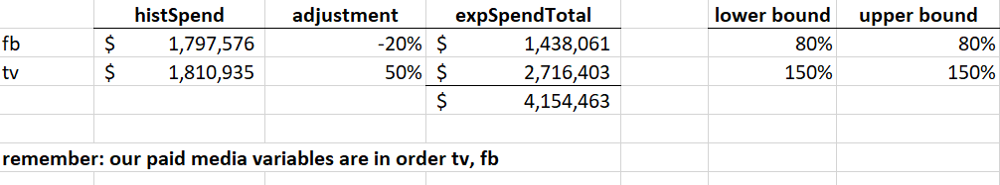

# Budget Allocation

**Purpose**: Evaluate Effectiveness of Robyn in Budget Allocation

**How**: Using Two-Variable Toy Data Set with Diminishing Returns for One Variable (FB)

**Analysis**: running robyn_allocator

**Version**: Robyn 3.4.8

Since documentation may be light on running budget allocation, we also fill in the process
so users can readily execute allocation.

# Findings

The budget allocator worked largely as described.  There are some minor comments about marginal v. average ROI,
but few surprises occurred here.

We observe that the allocator uses an average daily spend, and therefore would be less accurate in cases where
high variance exists across units of time (days typically) in paid search.  While robyn_allocator() uses one 
point on the curve, representing this mean investment, the waterfall and model approaches are rolling through
a pattern of paid media which is variable and draws from different places on the curve.

One consequence is that the resulting figures from the budget allocator may not match the waterfall exactly, and another
is to recognize that the allocator exists for a broad stroke projection, not a detailed forecast which might include
daily planning along with relevant context and seasonal considerations.

# Script

We start with the R script robyn_two_var_tv_fb.R and added code to run the budget allocation.

## robyn_allocator

Robyn_allocator() requires either an object, or the combination of InputCollect, OutputCollect and 
a selected model (select_model).  We executed the toy data set model fitting, and then selected model
1_248_6 because it was lexically the first one on a Pareto Front.

The code is:
```angular2html
# select a particular model
select_model = '1_248_6'

# this version has bug where channel_constr_low and channel_construct_up must have same length as paid_media_vars (2)
channel_constr_low = c(0.5, 0.5)
channel_constr_up = c(2, 2)
alloc = robyn_allocator(InputCollect=InputCollect, OutputCollect=OutputCollect, select_model=select_model, channel_constr_low=channel_constr_low, channel_constr_up=channel_constr_up)
```
*Note: with Robyn 3.4.8 we had to pass in channel_constr_low and _up or we ran into an error where the length of the default
variable did not match the length of paid_media_vars. We presume this will not be a requirement in future versions.*

The output is then generated into xxx_reallocated.csv, in our case, 1_248_6_reallocated.csv.

The [data dictionary for the xxx_reallocated.csv file](https://github.com/facebookexperimental/Robyn/blob/1095d87d2910c87a50ad545b4888bef57a05cf58/demo/schema.R)
covers the key fields.  We highlight some interesting ones here along with observations on values encountered:

```angular2html
histSpend: spend per channel

histSpendTotal: total spend obtained by summing all channels

initSpendUnit: mean histSpend for time grain (one day); in our case this is histSpend divided by 365 (days)

initSpendUnitTotal: sum of the initSpendUnit fields (just at the daily grain)

initSpendShare: percentage of historical spend per channel

initResponseUnit: this is the resposne of initSpendUnit.  Here we found fb was 128 times initSpendUnit and TV was 168 times.
(We recall from construction of data set that each $1 of TV produced $250 bookings, so the 168 is presumably an estimate of this.  The
relationship for FB spend is more complicated as it is non-linear in our model.)

initResponseUnitTotal: simply sum of initResponseUnit.  At this point, it seems that Robyn is showing us the total effect of all the spend.
Of course, we are interested in whether this is different from what the waterfall had shown for this model.  Further comments below.

initRoiUnit: this matches the ratio between initResponseUnit and initSpendUnit (128 and 168).

expSpendTotal, expSpendUnitTotal, expSpendUnitDelta: these variables only come into play when the user selects an alternative to the "max_historical_response" scenario

The next fields pertain to the optimized results:

optmSpendUnit: this represents the proposed spend across channels.  In our case, the optimal spend unit shifts from FB to TV considerably.

optmSpendUnitDelta: may not seem important at first, but this should be reviewed by the analyst to determine whether interaction occurred
with the channel_constr_low and channel_constr_up variables.  For example, we had channel_constr_low at 0.5 so the optimizer could not reduce
spending below 50% of the initial spend.  With the optmSpendUnitDelta = -0.5 we can see that the constraint has been hit, and so the optimizer
is answering the budget allocation posed only within the constraints provided by the function call.

optmResponseUnitTotal and optmResponseUnitTotalLift will show the lift of the proposed budget reallocation.

optmRoiUnit shows the ROI for unit investment in each channel.  In principle we would want to see the *marginal* ROI being the same
for all channels (absent a constraint), but the optmRoiUnit is probably an average rather than marginal return.  In our case, the initial
run shows a higher optmRoiUnit for FB than TV, but as FB has hit a lower constraint as it is being reduced, it does not seem the optimizer
will be seeking equality for these ROIs.
```

### Comparing initResponseUnitTotal with Waterfall

Waterfall Bookings Contribution (xDecompAgg):
* FB: 225,266,932
* TV: 299,734,164

reallocated.csv initResponseUnit (daily values):
* FB: 628,698
* TV: 833,365

Multiplying the initResponseUnits by 365 (days) we get:
* FB: 229,474,853
* TV: 304,178,370

Interestingly these are very close but not identical to the waterfall figures for 1_248_6.
Therefore the *baseline* for allocator comparisons are not identical with the waterfall.  One could probably use
the lifts produced by the allocator directly, but if one uses the "optimal response" from the allocator and compares
with the waterfall figures, the percentages will vary.  We feel the use of this lift may be more appropriate (consistent)
than mixing the numbers from the two systems.

*Our current hypothesis is that robyn_allocator() uses the response function from the average daily spend, whereas
the waterfall is based on actual model history with a daily adstock progression and therefore reflects what actual
values are used from the response function each day.  This difference is important to understand when one engages
in a reallocation, as this will not tie directly to the waterfall figures.*

## Visualization

After the reallocation is run, the budget allocation will produce output showing the optimized spend levels.

Initial one-pager produced by Robyn for 1_248_6:


Reallocated solution (with constraint of 0.5 / 2.0):


## Re-running with fewer constraints

Robyn limits the possible input for lower and upper channel spend shift:
* channel_constr_low must be 0.01 or greater.  You cannot zero a channel, but must spend 1% of historical spend.
* channel_constr_up generates an "unrealistic warning" if 5 or greater is supplied.

These limits suggest the Robyn team is expecting marketing to use reallocation for incremental shifts and learning, rather
than what-if scenarios which are far away from the historical evidence.

We re-ran with 0.01 and 20, so we could remove constraint effects in the solution.

Indeed, we see a further reallocation from our hypothetical FB to TV variables with the constraint removed, and in this
case the optimizer has not driven all the way to the constraint.

Reallocated solution without constraint:


We see a 74% decrease in FB spend and a 74% increase in FB spend, this time producing a lift of 21%, a purported
improvement on the 18% lift from the earlier scenario.

## What-If Reallocations

From a what-if standpoint, we may be interested in producing the effect of successive reallocations to understand
how the lift has varied with these changes.  Most marketing organizations would be reluctant to a sudden shift to a 
new equilibrium far away from the present. What if we could quickly estimate lift from smaller adjustments.

In our case we already have two data points (we will specify as % shift away from the FB spend):
* 50% reduction (initial constraint): 18% lift
* 74% reduction (no constraint hit, therefore maximum conceivable shift): 21% lift

A quick-and-dirty approach would be to invoke robyn_allocator() with different channel_constr_low and map the 
lift to reduction relationship.  This answers how much bang-for-buck one can get from incremental shifts and win
support in an organization for testing in a plausible direction.

Illustrating
* 10% reduction (channel_constr_low=0.9): 4.4% lift
* 20% reduction: 8.6% lift
* 30% reduction: 12.2% lift
* 40% reduction: 15.3% lift

And with your handy spreadsheet you have something to discuss with your stakeholders:


## Future Response with robyn_allocator()

### Repeating History

robyn_allocator() purports to run future spend allocations as alternative to historical spend allocations.
It seems that this assumes the future context and non-paid-media variables are behaving essentially the same as
in the historic period (including seasonal effects). 

One test for this future spend would be to send robyn_allocator exactly the figures used in the historic period
with the same constraints and determine whether the reallocated solution is identical to the historical one.

Code to run future mode with historical data:

```angular2html
AllocatorCollect <- robyn_allocator(
  InputCollect=InputCollect, 
  OutputCollect=OutputCollect, 
  select_model=select_model,
  scenario = "max_response_expected_spend",
  channel_constr_low = c(0.01, 0.01),
  channel_constr_up = c(20, 20),
  expected_spend = 3608511,  # match historical for this test
  expected_spend_days = 365
)
```

The result of this run was substantively equivalent to the historic run.  A few values differed by 
inconsequential amounts, but the effect was identical.

### Doubling History

In this case, we doubled the expenditures from the historical period to determine how robyn_allocator() would
allocate and report on the additional funds.

In our case:
* histSpendTotal: 3,608,511
* expSpendTotal: 2 * histSpendTotal = 7,217,022

We see some interesting differences in results:
* At historic levels, FB spend share is optimally 13% (TV remainder)
* At double historic levels, FB spend share is optimally 20%

While the optimal ROI per unit do not match in the historic case (227 and 171), we see roughly 
equal values here at 142.8 and 142.3.  As we said above, I think these are average not marginal values, so the 
analyst should reflect on what is desired here.

The lift is calculated at 93% instead of 21%.  Thus, the reported lift is not adjusted for the
increased expenditure level.

We can compute the total response as 2,815,527 and the total investment of 7,217,022.
The lift calculation used here is relative to the response from the original investment 1,462,064.

An analyst should understand that this lift is the sum of optimization and increased spend, rather than
simply one of these.  And since the percentage spend allocation is different at higher scale, one might ponder
before simply taking the difference to estimate the scale effect.

### Estimating Scale Effects v. Shift Effects

One method to estimate scale effects might be to increase the spend and maintain the proportion, and then separately 
examine the effect of shifting proportion.

Setting the channel_constr_low and _up to 1.0 does not work with robyn_allocator()
because the current logic prevents the expenditures from
scaling in this case.  Therefore, we next try setting _up and _low to 2.0 when doubling the expenditures.

Setting both to 2.0 we obtain a 71% lift effect from scaling up the investment.
We had a shift effect of 21% at the initial level.
And the remaining 1% of the 93% lift is attributable either or both to the scaling and shift.

## What-If Analysis

robyn_allocator() could be leveraged for full what-if analysis.

In this case, one wants to shut down the optimizer, and essentially use robyn_allocator() to calculate
the effect of proposed expenditures.

### Why would we take this approach?

The Robyn team has developed the mathematical logic for response curves, and it may prove better to leverage
the Robyn code directly than write additional code which produces these response calculations.  While one's own
function  might work, it creates significant technical maintenance risk one might avoid.

### How to accomplish what-if analysis

The current implementation of robyn_allocator() has constraints per channel on spend (lower bound and upper bound)
relative to the historic spend.  This constraint supercedes providing any data on the total expenditures (when the
two come into conflict, the xxx_reallocated.csv reflects the constraints and shows inconsistent optimized
spend and total expenditures).  Therefore, one needs to set the constraints correctly to adjust the optimizer.

#### Simple Case: Doubling a Channel

Here one doubles one channel and not the other:
```
AllocatorCollect <- robyn_allocator(
  InputCollect=InputCollect, 
  OutputCollect=OutputCollect, 
  select_model=select_model,
  scenario = "max_response_expected_spend",
  channel_constr_low = c(2, 1),
  channel_constr_up = c(2, 1),
  expected_spend = 5406087,  # ideally one would double the first channel and input the value here
  expected_spend_days = 365
)
```

Verifying results:
* optmSpendUnitDelta=1 for one channel, and 0 for the second channel.

Cautions:
* channel_constr_low and _up are in a particular sequence and this is not the same order of rows in the resulting .csv file.

This code shows the sequence of variables which channel_constr_low and _up must match:
```angular2html
InputCollect$paid_media_spends
```

Ideally, the channel_constr_low and _up should be a dictionary rather than a list so mistakes can be avoided.
Currently, the sequence will match the paid media sequence passed into the InputCollect by the user.

#### Complex Case: Adjusting multiple channels

Here we illustrate planning an adjustment where one channel is reduced by 20% and the other increased by 50%.
If we want fully consistent results, we also calculate the new expected spend so we are letting the analysis
show that constraint (which otherwise could be inconsistent).



We then pass this into the allocator:
```angular2html
  AllocatorCollect <- robyn_allocator(
    InputCollect=InputCollect, 
    OutputCollect=OutputCollect, 
    select_model=select_model,
    scenario = "max_response_expected_spend",
    channel_constr_low = c(1.5, 0.8),
    channel_constr_up = c(1.5, 0.8),
    expected_spend = 4154463,  # ideally one would double the first channel and input the value here
    expected_spend_days = 365
  )  
```
*Pay attention to the paid media channel order.  We have forced the lower and upper constraint to be identical
so the optimizer has no interesting work to do.  This is simply a what-if for the user.*

The result shows a 26.8% lift, which as we indicated before is the result both of shifting and scaling paid
media investment.

The optimal response total is 1,853,717 which is 26.8% higher than the initial $1,462,064.
Both figures have to be multiplied by number of days to loosely correspond to the original waterfall and results:
$534 million increased to $677 million.

The cost for this increase should be obtained from optmSpendUnitTotal times 365 (more reliable than expSpend if 
inconsistency arises.)  Comparing this to the initSpendUnitTotal, we see that we have increased our total paid media
investment from $3.6 million to $4.2 million to produce this increase.

Of course, these are all hypothetical relationships and values, and this illustration is intended to show how
the robyn_allocator() could be applied to what-if problems.


### Interpretation of what-if at full time scale

The optimal response unit is for a single unit of time (typically a day).

Options to scale up the response:
* Apply the lift to the original waterfall or scaled variables.  (This may make sense if the stakeholders 
are deeply connected to the waterfall figures, and seems like a sensible approximation of scaling those variables.)
* Scale the optimal response unit by the number of time units (perhaps 365 days) to get the full period effect.

