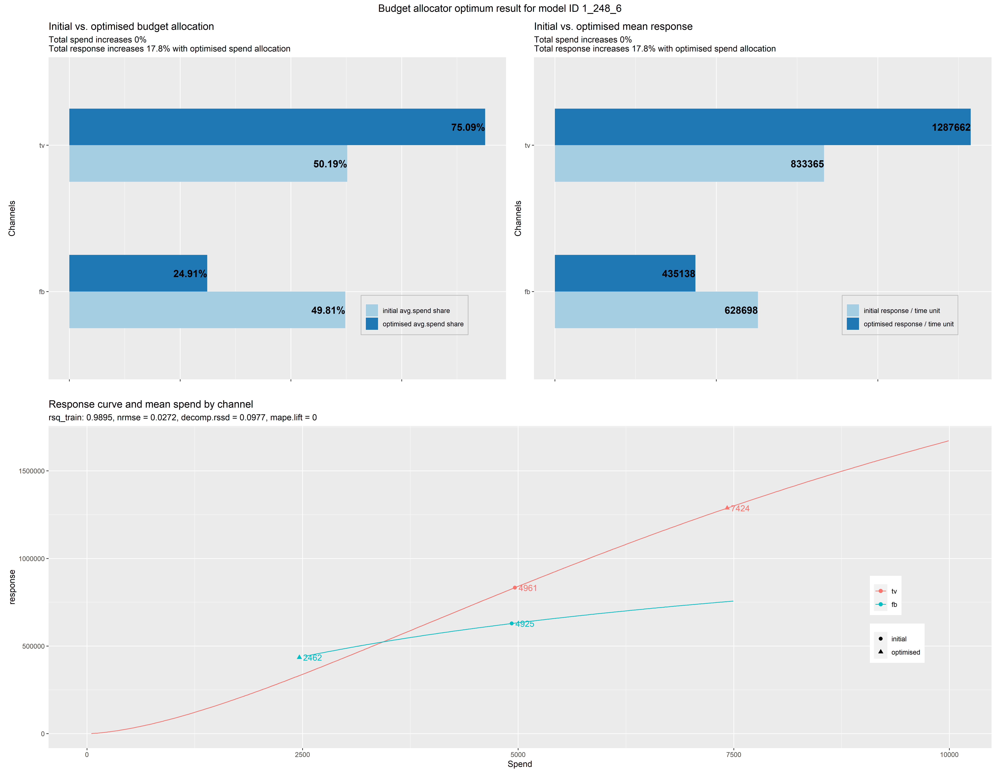
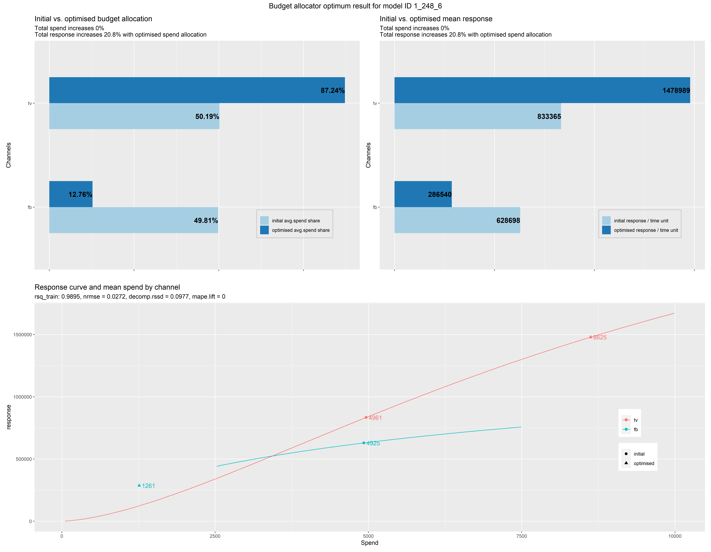
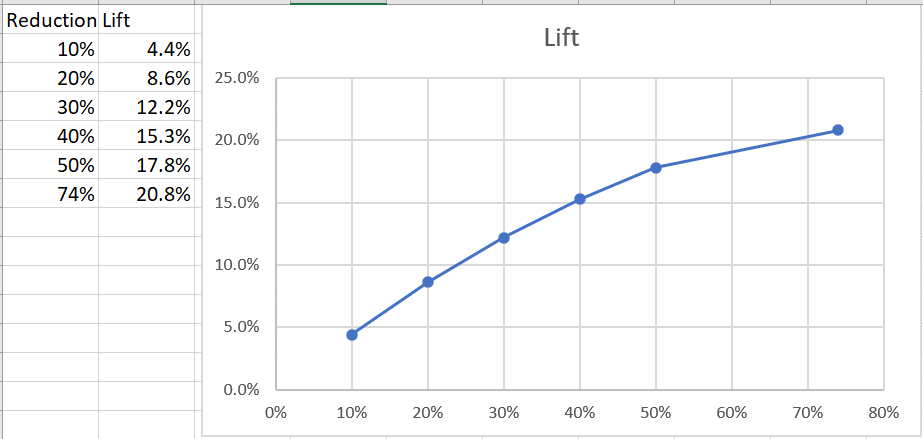

# Budget Allocation

**Purpose**: Evaluate Effectiveness of Robyn in Budget Allocation

**How**: Using Two-Variable Toy Data Set with Diminishing Returns for One Variable (FB)

**Analysis**: running robyn_allocator

Since documentation may be light on running budget allocation, we also fill in the process
so users can readily execute allocation.

## Script

We start with the R script robyn_two_var_tv_fb.R and added code to run the budget allocation.

### robyn_allocator

Robyn_allocator() requires either an object, or the combination of InputCollect, OutputCollect and 
a selected model (select_model).  We executed the toy data set model fitting, and then selected model
1_248_6 because it was lexically the first one on a Pareto Front.

The code is:
```angular2html
# select a particular model
select_model = '1_248_6'

# this version has bug where channel_constr_low and channel_construct_up must have same length as paid_media_vars (2)
channel_constr_low = c(0.5, 0.5)
channel_constr_up = c(2, 2)
alloc = robyn_allocator(InputCollect=InputCollect, OutputCollect=OutputCollect, select_model=select_model, channel_constr_low=channel_constr_low, channel_constr_up=channel_constr_up)
```
*Note: with Robyn 3.4.8 we had to pass in channel_constr_low and _up or we ran into an error where the length of the default
variable did not match the length of paid_media_vars. We presume this will not be a requirement in future versions.*

The output is then generated into xxx_reallocated.csv, in our case, 1_248_6_reallocated.csv.

The [data dictionary for the xxx_reallocated.csv file](https://github.com/facebookexperimental/Robyn/blob/1095d87d2910c87a50ad545b4888bef57a05cf58/demo/schema.R)
covers the key fields.  We highlight some interesting ones here along with observations on values encountered:

```angular2html
histSpend: spend per channel

histSpendTotal: total spend obtained by summing all channels

initSpendUnit: mean histSpend for time grain (one day); in our case this is histSpend divided by 365 (days)

initSpendUnitTotal: sum of the initSpendUnit fields (just at the daily grain)

initSpendShare: percentage of historical spend per channel

initResponseUnit: this is the resposne of initSpendUnit.  Here we found fb was 128 times initSpendUnit and TV was 168 times.
(We recall from construction of data set that each $1 of TV produced $250 bookings, so the 168 is presumably an estimate of this.  The
relationship for FB spend is more complicated as it is non-linear in our model.)

initResponseUnitTotal: simply sum of initResponseUnit.  At this point, it seems that Robyn is showing us the total effect of all the spend.
Of course, we are interested in whether this is different from what the waterfall had shown for this model.  Further comments below.

initRoiUnit: this matches the ratio between initResponseUnit and initSpendUnit (128 and 168).

expSpendTotal, expSpendUnitTotal, expSpendUnitDelta: these variables only come into play when the user selects an alternative to the "max_historical_response" scenario

The next fields pertain to the optimized results:

optmSpendUnit: this represents the proposed spend across channels.  In our case, the optimal spend unit shifts from FB to TV considerably.

optmSpendUnitDelta: may not seem important at first, but this should be reviewed by the analyst to determine whether interaction occurred
with the channel_constr_low and channel_constr_up variables.  For example, we had channel_constr_low at 0.5 so the optimizer could not reduce
spending below 50% of the initial spend.  With the optmSpendUnitDelta = -0.5 we can see that the constraint has been hit, and so the optimizer
is answering the budget allocation posed only within the constraints provided by the function call.

optmResponseUnitTotal and optmResponseUnitTotalLift will show the lift of the proposed budget reallocation.

optmRoiUnit shows the ROI for unit investment in each channel.  In principle we would want to see the *marginal* ROI being the same
for all channels (absent a constraint), but the optmRoiUnit is probably an average rather than marginal return.  In our case, the initial
run shows a higher optmRoiUnit for FB than TV, but as FB has hit a lower constraint as it is being reduced, it does not seem the optimizer
will be seeking equality for these ROIs.
```

#### Comparing initResponseUnitTotal with Waterfall

Waterfall Bookings Contribution (xDecompAgg):
* FB: 225,266,932
* TV: 299,734,164

reallocated.csv initResponseUnit:
* FB: 628,698
* TV: 833,365

Multiplying the initResponseUnits by 365 (days) we get:
* FB: 229,474,853
* TV: 304,178,370

Interestingly these are very close but not identical to the waterfall figures for 1_248_6.

### Visualization

After the reallocation is run, the budget allocation will produce output showing the optimized spend levels.

Initial solution:


Reallocated solution (with constraint of 0.5 / 2.0):




### Re-running with fewer constraints

Robyn limits the possible inputs:
* channel_constr_low must be 0.01 or greater.  You cannot zero a channel, but must spend 1% of historical spend.
* channel_constr_up generates an "unrealistic warning" if 5 or greater is supplied.

These limits suggest the Robyn team is expecting marketing to use reallocation for incremental shifts and learning, rather
than what-if scenarios which are far away from the historical evidence.

We re-ran with 0.01 and 20, so we could remove constraint effects in the solution.

Indeed, we see a further reallocation from our hypothetical FB to TV variables with the constraint removed, and in this
case the optimizer has not driven all the way to the constraint.



We see a 74% decrease in FB spend and a 74% increase in FB spend, this time producing a lift of 21%, a purported
improvement on the 18% lift from the earlier scenario.

## What-If Reallocations

From a what-if standpoint, we may be interested in producing the effect of successive reallocations to understand
how the lift has varied with these changes.  Most marketing organizations would be reluctant to a sudden shift to a 
new equilibrium far away from the present. What if we could quickly estimate lift from smaller adjustments.

In our case we already have two data points (we will specify as % shift away from the FB spend):
* 50% reduction (initial constraint): 18% lift
* 74% reduction (no constraint hit, therefore maximum conceivable shift): 21% lift

A quick-and-dirty approach would be to invoke robyn_allocator() with different channel_constr_low and map the 
lift to reduction relationship.  This answers how much bang-for-buck one can get from incremental shifts and win
support in an organization for testing in a plausible direction.

Illustrating
* 10% reduction (channel_constr_low=0.9): 4.4% lift
* 20% reduction: 8.6% lift
* 30% reduction: 12.2% lift
* 40% reduction: 15.3% lift

And with your handy spreadsheet you have something to discuss with your stakeholders:




