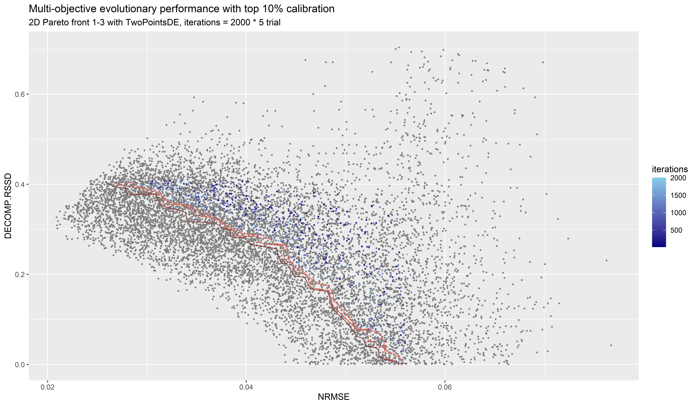
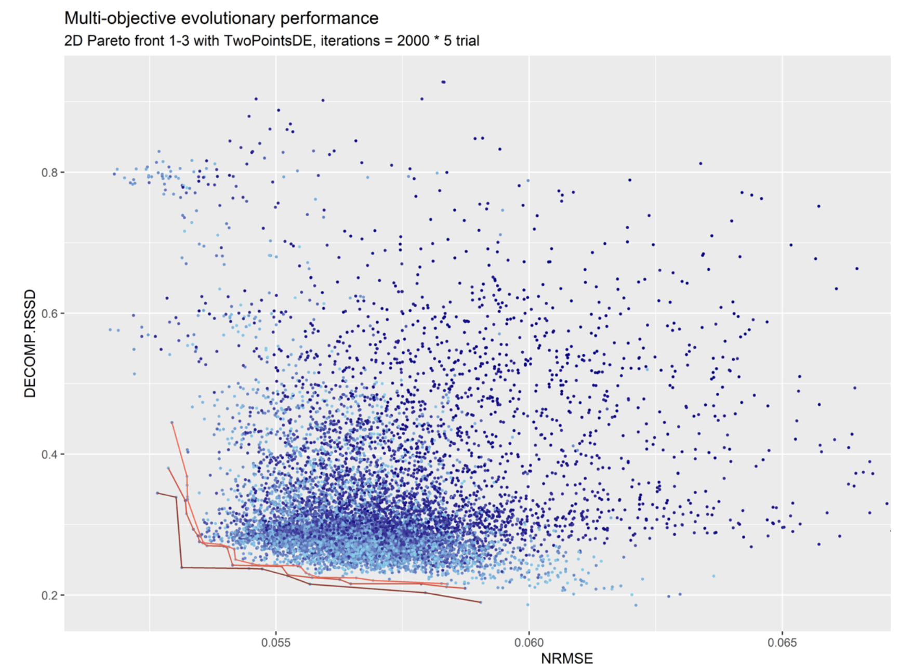

# Calibration Test

## Objectives
* Assess Impact of Calibration on Robyn Solutions Using Toy Data Set
* Provide a detailed example of how calibration works to supplement the information available in the
[Robyn calibration docs](https://facebookexperimental.github.io/Robyn/docs/calibration/) and
[Robyn example setup](https://facebookexperimental.github.io/Robyn/docs/demo-R-script#step-2a-4-model-calibration-optional), 
thereby supporting practitioners wishing to experiment with calibration.

**Approach**: Using a toy data set with known (generated) ground truth, run once with calibration and once without.

**Calibration Data**: A single day of one channel using "ground truth". The smallest calibration possible within Robyn.

**Data Set**: robyn_toy_data_2paidvar_bal_effratio_600000err.csv [described in README](README.md).

|             | 2022-01-28 18.52 | 2022-01-28 20.01                                       |
|-------------|-----------------|--------------------------------------------------------|
| calibration | no              | yes                                                    |
| target      | bookings_noiseless | bookings_noiseless                                     |
| predictors  | FB & TV (no context) | FB & TV (no context)                                   |\
| calibration data | none            | July 1 2021, FB only - using ground truth contribution |

Note: in selecting this *effectiveness ratio* data set, we have set the FB effect at three times the effect of TV
on bookings.  This adds an extra challenge to Robyn, which inherently prefers solutions where
the *average* effectiveness of all channels is equivalent.  (The decomp.RSSD minimization is solved
by having every variable have the same *average* effectiveness.)

Further note: one critique of the Robyn "equal average effect" optimization target is that it contradicts
marketing's optimization target which should be "equal marginal effect".  However, as many marketing departments
are less sophisticated or do not have tools to measure marginal effect, it is possible that the Robyn target
is an approximation for marginal effects which could be acceptable.  However, we do not think this is an 
aspiration for marketing!


## Pareto Fronts Compared

We ran 5 trials for 2000 iterations of each model and here compare the Pareto Fronts.

### Uncalibrated
The uncalibrated Pareto Front shows values which range from best NRMSE (0.02) to best DECOMP.RSSD (0.0) at 
NRMSE > 0.04.


### Calibrated

The calibrated Pareto Front shows that there are points near the uncalibrated Pareto Front, but these are 
disqualified as potential solutions.  "Disqualified" solutions are depicated in gray.



## Disqualification

### Disqualification Process for Uncalibrated Robyn Runs

When doing an uncalibrated Robyn Run, two solution "popularity" (percentile) are examined and can disqualify a
solution from being included in a Pareto Front:
* Worst 10% of NRMSE solutions
* Worst 10% of decomp.RSSD solutions

Note: when doing an uncalibrated Pareto Front the disqualified data points are not colored distinctly from the
qualified data points. 

Rationale: We expect the Robyn team has disqualified certain data points because they may seem "extreme".
These extreme points could otherwise occur at the two ends (or wings) of the Pareto Front.  If you look at a
Pareto Front and notice certain data points which look like they belong to the Pareto Front, but occur
at either extreme, their exclusion may be due to disqualification.  The following image (data not supplied) gives
an example where disqualification has occurred for points in the upper left, and therefore the Pareto Front lines
do not continue to extend into that space:



Implications: Since nevergrad is optimizing to a balanced minimum of decomp.RSSD and NRMSE, its exploration may not include
as many solutions favoring only one variable on its own.  The lack of exploration may contribute to 
disqualification, since disqualification is not based on poor performance but instead on lack of *popularity* in the
solution space.  Therefore, good solutions for ground truth could be disqualified from the Pareto Front simply
due to sitting far away from the nevergrad optimization target.  Thus, while the Pareto Front visually suggests
that Robyn has pushed the Robyn front in all ways as much as possible, in reality the balanced target for nevergrad
causes greatest exploration near the balanced target, and less exploration on the wings of the Pareto Front.

In the case of our toy data set, we have a 3:1 effectiveness ratio between two channels.  We believe that 
disqualification and nevergrad optimization may make it difficult for Robyn to produce solutions where ground truth
is represented by even stronger discrepancies in *average* effectiveness.

### Disqualification Process for Calibrated Robyn Runs:

For a calibrated run, disqualification is expanded to three criteria:
* Worst 10% of NRMSE solutions
* Worst 10% of decomp.RSSD solutions
* Worst 90% of calibration solutions (based on MAPE) - tunable coefficient

To explain this new criteria, first we need to explain the MAPE calculation.

The calibration data input identifies one or more days and channels for which input is provided.
The MAPE calculation (summarized in all_aggregated.csv) simply calculates the Mean Absolute Percentage Error
for the target contribution during the calibrated period.

The MAPE calculation is: abs(observed - calibrated) / calibrated.
(When reproducing this calculation, note the denominator is the calibrated value.)

Every solution has an associated MAPE value.  These MAPEs are ranked to compute the 10th percentile, and
any solutions achieving worse than 10th percentile (i.e. 90% of the solutions) are disqualified.  

In generating the Pareto Front diagram, the Robyn code marks the iteration number as "NA" resultining in gray
dots for solutions falling afoul of *any* of the disqualifying criteria.

The user can tune the calibration constraint, although without source code changes can only make the calibration
constant more *restrictive*.  calibration_constant=0.1 by default meaning 90% of models are disqualified.  If one
set the calibration_constant=0.02 it would mean that 98% of models are disqualified.

Our *sense* of how this should work is that disqualification should bear some proportion to the amount of 
calibration information provided, and as we see in the case documented here, with a single day calibration it
feels like the ten percent *least restrictive* assumption is actually *too* restrictive.

But this brings us to another point: there is a distinction between the nevergrad optimization and disqualification.

## Nevergrad and Solution Generation

Disqualification occurs at the end of the solution search, when a small subset of solutions is proposed
for the Pareto front. However, more important is the process by which nevergrad searches in that solution space.

When engaged in calibrated search, nevergrad shifts from optimizing two values (nrmse, decomp.rssd) to optimizing three 
simultaneous targets (nrmse, decomp.rssd, and mape).  

In practice, this has some important implications on how Robyn runs:
* NRMSE (which we believe may be most important for ground truth) now has two competitors
* Search space will increasingly target solutions with low MAPE

After all solutions are generated, nevergrad's actions have implications for disqualification:
As the search space targets around low values of MAPE, we may have spent less time around the best
values for NRMSE and decomp.RSSD.  Each of these three values have percentile based disqualification, in which
case *where nevergrad spends its time impacts popularity of solutions, which in turn drives disqualification*.
So solutions which might have been closer to ground truth may be removed from the Pareto Front simply due to 
how nevergrad search was impacted.  Thus, the calibration impact on search focus may have a significant impact on qualifying
Pareto Front solutions.

Looking again at the calibrated solution we can see some of this:


Firstly, we note that the Pareto Front is sort of a hybrid between a 2-D and a 3-D front.
At first glance the front shown appears suboptimal, because the solutions are interior to the dot pattern.
But in reality there is a third dimenion, MAPE, which one could imagine coming out of the paper towards the viewer,
and the solutions have to exist above a certain MAPE slice to be considered.

However, the Pareto Front is not a 3-D front of these three variables, but appears to be a 2-D front of the two
variables (decomp.RSSD and NRMSE), with a cutoff (disqualification) for MAPE which is strict.

Thus, the MAPE criteria seems to be the *strictest* criteria in the Pareto Front generation space, and subject
to that MAPE *constraint* the Pareto Front is generated.

And again one concern we have is that the MAPE impact is not related to the amount of calibration
infromation.  If we had very significant calibration data we think the ten percentile assumption
would seem reasonable, but as the user  may have little experimental data,
this large impact should give the user pause, or at least suggest why they might need to modify the open source Robyn code 
and allow much more relaxed calibration_constraints.


## Our Example in some Detail

The purpose of our example is to provide Robyn data which has no stochastic element and could conceivably
lead to correct determination of ground truth.

We use the data set: robyn_toy_data_2paidvar_bal_effratio_600000err.csv
The target is *bookings_noisless*, which as we have [documented](README.md), assumes that the target variable (bookings)
is simply a function of two paid media variables: TV and FB.

The formula is bookings_noiseless = 10,000,000 + 200 * TV + 600 * FB

FB is three times as effective as TV in this model. The fixed value of $10,000,000 represents the fixed momentum
of the business prior to any advertising spend.  The use of the terms "TV" and "FB" are arbitrary stand-ins for
paid media and have no actual connection to any business.

For each day, FB and TV are randomly generated, and in the data set we facilitate data analysis by exposing
the variables fb_contribution and tv_contribution to make is easy to determine what an idealized MMM solution
would detect (the ground truth).

### Coding Calibration Lift

In our calibration context, we read out the July 1 2021 value of FB_contribution and we supplied that to the
contribution lift as follows:

July 1: bookings_noiseless = 10,000,000 + 4,489,200 + 1,139,600
that is the base plus FB contribution (4,489,200) and the TV contribution.

Using the calibration code in Robyn we inject:
```angular2html
dt_calibration <- data.frame(
  channel = c("fb")
  , liftStartDate = as.Date(c("2021-07-01"))
  , liftEndDate = as.Date(c("2021-07-01"))
  , liftAbs = c(4489200)
)
```
We note that the liftStartDate and liftEndDate are inclusive (so this is just one day), 
and using pareto_decomp_matrix.csv for July 1, we
can validate the MAPE calculation to be: abs(est_fb_effect - 4489200) / 4489200.

### decomp.RSSD

Since we *assume* that FB has three times the effect of TV spend, we are challenging Robyn to find solutions which are 
away from the nevergrad optimization target (it assumes equal average effects for all paid media variables).

Note: in our case we assume the average and marginal effects of paid media spend are identical and there is no
carry over from day to day (theta=0).  We have set the hyperparameter search ranges to hint at the small theta values:

```angular2html
hyperparameters <- list(
 tv_alphas = c(0, 2.0)  
  , tv_gammas = c(0.3, 1.0)
  , tv_thetas = c(0, 0.2) 
  , fb_alphas = c(0, 2.0)
  , fb_gammas = c(0.3, 1.0)
  , fb_thetas = c(0, 0.2)
)
```

An interesting question as one reviews the Pareto Front for the two solutions is what should the decomp.RSSD be if 
Robyn were to detect our ground truth?

To compute this, we calculate the spend share and the effect share we would have expected to see:

|     | spend share | unnormalized effect   | effect share (normalized) | square diff (effect - spend) |
|-----|-------------|-----------------------|---------------------------|------------------------------|
| fb  | 0.49815     | 3 * 0.49815 = 1.49445 | 0.74861                   | 0.06273                      |
| tv  | 0.50185     | 0.50185               | 0.25139                   | 0.06273                      |
|     |             |                       |                           | sum of sq diff = 0.12546     |
 |     |             |                        |                          | sqrt of above = 0.3542 (target) |

The ground truth solution will have decomp.RSSD = 0.3542.

Interesting observations about the Pareto Fronts above:
* Uncalibrated: the decomp.RSSDs in the Pareto Front seem to cap out around 0.3 (below ground truth target).  
There is limited model exploration much above 0.3, so we do not know whether Robyn could have found smaller NRMSEs in that space.

* Calibrated: the decomp.RSSDs in the final soloution extend above 0.3542, but NRMSEs are far away from the 
frontier.  Points near the frontier are disqualified due to MAPE.

In our case, this initial calibration chart was done with only 5 trials of 2000 iterations, so further testing
may determine whether solutions could emerge in this space.  But at the moment it seems that the MAPE for solutions
near ground truth are too high and searching this space may be a bit limited.  We do not yet know whether in our
case this is due to hyperparameters or tension we have setup with decomp.RSSD.

## Reproducing Results

The R script [robyn_two_var_fb_only_calibration.R](robyn_two_var_fb_only_calibration.R) can be used to reproduce the results described here.

### Robyn Version

The Robyn code is based on a [forked version of the Robyn repository](https://github.com/joangcc/Robyn/tree/free_intercept).
Using the "free_intercept" branch one can select the version of the branch indicated in this R script.

Reasons for using this branch is that we had innovations not yet introduced into Robyn such as allowing negative intercepts.
