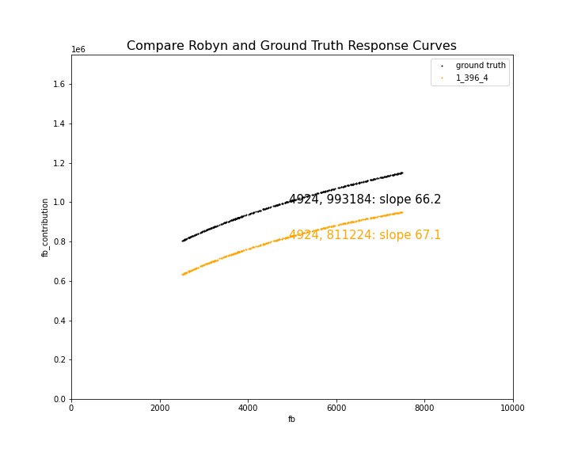

# Robyn Response Modeling

**Purpose**: Compare Effectiveness of Robyn in Accurately Detecting Different Response Functions

**How**: Using Two-Variable Toy Data Sets

**Analysis Uses**: Full set of solutions in all_aggregated.csv (not just Pareto Front solutions)

## Null Hypothesis

Robyn measures the response curve correctly for paid media with diminishing returns

Two questions:
* Is the estimate of the total effect correct?
* Is the marginal estimate (response curve) correct?

## Setup

[Case Diminishing](robyn_output/2022-02-01_18.45_init): Two variables (FB, TV) FB is non-linear in spend and TV
is linear in spend

Here we have a new case generated from the data set robyn_toy_data_2paidvar_bal_eff2ratio_dimret_600000err.csv.

The ipynb file generating this data set has supporting details on the mathematical equation used to create 
diminishing returns.  As with other data sets, there is a variable, fb, representing spend on fb, while there
is another variable, fb_contribution, representing the effect that spend has had.  In this case, fb_contribution
grows monotonically with fb spend, but with diminishing benefit to additional spend.

[Case Linear](robyn_output/2022-01-31_16.15_init): Two variables (FB, TV) where FB = 2 times the effect of TV
Here we simply use the same results from our effect ratio response study

## Results

### Accuracy

The question of accuracy we can take up using the diminishing results only.

On inspection of the various solution png images we can see that FB has a more flat response curve than TV.
So it appears at first blush that Robyn has successfully detected the diminishing return curve.  But we then
want to quantify this and ask how accurate is it?

To measure accuracy, we take the output from the pareto_media_transform_matrix.csv, and we plot the 
decomp_media (response variable) against the raw spend.  We believe this gives us the closest measure of the 
response and is the basis for generating the response curves we see in solution png files.

We can overlap these response curves with the ground truth response curve.  We do this in our file
AnalyzeDiminisingResponseAccuracy.ipynb. 

Here is an example overlaying one response curve with ground truth:

We observe two things which is common across Pareto Front 1 solutions:
* the response curve from Robyn lies below the ground truth response curve
* the slope of the response curve from Robyn is similar to the ground truth response curve

Reviewing all_aggregated.csv we can see the xDecompAgg for all Pareto Front #1 solutions for fb 
coefficients.  These values average 282 million dollars.   From the ground truth data set we know
that we were looking for an overall contribution of 362 million.  Robyn has underestimated the total
effect of fb on our target variable, and this is consistent with the lower solution lines than ground 
truth lines.

For slope estimation, we chose the 10 points below the mean and 10 points above the mean to construct
an estimate of the slope around the mean.  (Selecting only one point below and above on the Robyn curve
led to more variable values.)  

Across the Pareto Front 1 solutions the mean slope was 64.26, not far off the ground truth of 66.2
The minimum from any solution was 60.2 and the maximum was 76.2.  

From this we estimate that Robyn provided a pretty good estimate of the slope in the diminishing returns
case.  Furthermore, examination of the generated png files shows that Robyn consistently shows the 
slope of the FB spend to be more flat than the TV spend in the vicinity of the mean, correctly representing
that a significant difference exists in marginal impact of spending in these two channels.

Consider this example:

Examining the Response Curve chart (middle chart on the right side), Robyn shows that the tv spend
has considerably greater slope than the fb spend, as expected.  This finding gives us confidence
in the response curve results with stakeholders.

### Comparing Data Sets

As we just stated, the diminishing return case resulted in model one-pagers which consisently showed 
more flat returns for fb than tv.

We can review a chart from the 2:1 effectiveness study of fb and tv:

Here, we see that FB and TV look largely linear in the vicinity of their mean, and the FB chart is has
a higher slope in accordance with the greater effect.

While we have not quantified these slopes at this point, this lends credibility to Robyn's detection 
of response curve (slopes).
