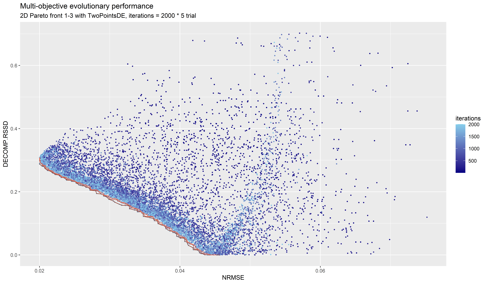
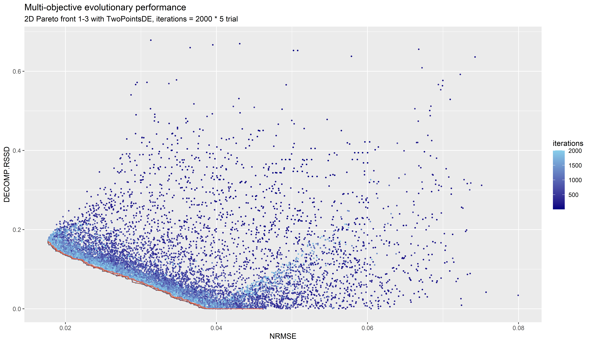

# Robyn Response to Effect Ratio

**Purpose**: Compare Effectiveness of Robyn in Accurately Detecting Different Effectiveness Ratios

**How**: Using Two-Variable Toy Data Sets

**Analysis Uses**: Full set of solutions in all_aggregated.csv (not just Pareto Front solutions)

## Hypothesis

decomp.RSSD minimization in nevergrad (and truncation of qualiying results) creates a bias
in favor of variables having identical average effects.

In practice, average (let alone marginal) effects are seldom identical.  

Having observed that decomp.RSSD drives towards equal average effects, we wanted to measure
whether Robyn was able to respond and detect relationships accurately when they departed from
identical average effects.

## Setup

[Case 3:1](robyn_output/2022-01-28_18.52_init): Two variables (FB, TV) where FB = 3 times the effect of TV

[Case 2:1](robyn_output/2022-01-31_16.15_init): Two variables (FB, TV) where FB = 2 times the effect of TV

No calibration.  Randomly generated two variable data sets.

## Results

### Case 3:1 Effectiveness

#### Ground Truth decomp.RSSD

FB spend: 49.814896%
TV spend: 50.185104%
FB contribution %: 74.861%
TV contribution = 1-FB contribution

ground truth RSSD = sqrt ( 2 * ((0.665019264-0.49814896)^2)) = 0.3542



We observe in this chart that there is quite a bit of exploration around decomp.rssd=0.3, but NRMSE seems to
to flatten above that level and so no points are eligible much above that point.

The highest decomp.RSSD in the three Pareto Fronts is 0.3092, falling a fair amount short of the
ground truth.

Looking at the full set of solutions (all_aggregated.csv), the solution with closest value to rssd=0.3542 is 
3_60_2 which has a nrmse of 0.026199 and decomp.rssd of 0.354104.  This point is in a thicket
of points in the vicinity of this ground truth rssd.

Looking at points with rssd between 0.353 and 0.355, the lowest NRMSE is 0.226 which is already 
substantially worse than the lowest NRMSE solutions.  Two solutions (1_333_6 and 4_329_4) have
NRMSE just below 0.02 (rounded to 0.02) and these have decomp RSSD of 0.308 and 0.290 respectively
with FB effect share at 71.6% and 70.3% a few points below ground truth FB contribution.

It seems that the nevergrad search point allowed some work around the 0.354 rssd level, but the
models found in that space did not match the (simplisitic) ground truth relationships.  

We are encouraged that the frontier includes points near ground truth.  For example, 
solution 4_329_4 falls on Pareto Front number 1 with a 70.3% FB effect and 29.7% TV effect.


### Case 2:1 Effectiveness

#### Ground Truth decomp.RSSD

FB spend: 49.814896%
TV spend: 50.185104%
FB contribution %: 66.5019264%
TV contribution = 1-FB contribution

ground truth RSSD = sqrt ( 2 * ((0.665019264-0.49814896)^2)) = 0.2360



In the image above, it seems that the Robyn solutions are not as close to the actual result
as they were in the 3:1 ratio.  This seems a bit surprising as the penalty for nevergrad
pursuing ground truth solutions should be less severe in the 2:1 case.

The highest decomp.RSSD in the three Pareto Fronts is 0.171 falling considerably short of 
ground truth rssd = 0.236.

Reviewing solutions with decomp.rssd between 0.235 and 0.237, the NRMSEs vary from 0.023 to 0.067.
The value of 0.023 is significantly worse than the lowest NRMSEs of 0.1768 which occur for two
different solutions (1_285_6 and 5_316_2) both of which are on the first Pareto Front.

Those Pareto Front solutions estimate a 62% effect of FB spending and 38% for TV spending,
four percent below ground truth.

### Conclusions

In both simulations, Robyn's exploration near the optimal RSSD produced lower NRMSEs than
its exploration at other points in the curve.  This initial analysis does not guide us in 
whether further exploration would have uncovered better performing NRMSE models in this space; it
is possible that nevergrad needed to spend more time in this space before being guided to
smaller decomp.RSSD's.

One conclusion is that Robyn will *understate* true differences which may exist across channels.
Therefore when Robyn reports differences, a possible conclusion is that the implied 
brackets or confidence intervals around Robyn reports should be thought to include more larger
effects rather than smaller effects, thus not a balanced interval.

We encourage further exploration of these data sets and approaches to discover how Robyn functions
and guide the team in further improvements.


## Reproducing

The code in robyn_two_var_tv_fb.r can be used to produce these results.

Some relevant assumptions:
```angular2html
window_start = "2021-01-01"                        # Robyn window start
window_end = "2021-12-31"                          # Robyn window end
trials =  5                                        # Robyn trials
iterations = 2000                                  # Robyn iterations
s
target_variable = 'bookings_noiseless'
paid_media_vars = c("tv", "fb")                          # variables to be tested, could be tv, fb
paid_media_spends = c("tv", "fb")                        # variables to be tested, could be tv, fb
paid_media_signs = c("positive", "positive")
context_vars = c()                                # context, could be c('context_0_center')
context_signs = c()                               # could be c('default')

# match number of media variables here; may need fb
hyperparameters <- list(
  tv_alphas = c(0, 2.0)  
  , tv_gammas = c(0.3, 1.0)
  , tv_thetas = c(0, 0.2) 
  , fb_alphas = c(0, 2.0)
  , fb_gammas = c(0.3, 1.0)
  , fb_thetas = c(0, 0.2)
)

```


